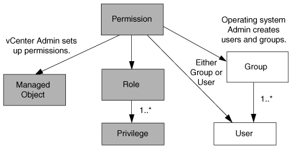

= Components of vCenter Server permissions
:icons: font
:imagesdir: ../media/

[.lead]
The vCenter Server recognizes permissions, not privileges. Each vCenter Server permission consists of three components.

The vCenter Server has the following components:

* One or more privileges (the role)
+
The privileges define the tasks that a user can perform.

* A vSphere object
+
The object is the target for the tasks.

* A user or group
+
The user or group defines who can perform the task.

As the following diagram illustrates, you must have all three elements in order to have a permission.

NOTE: In this diagram, the gray boxes indicate components that exist in the vCenter Server, and the white boxes indicate components that exist in the operating system where the vCenter Server is running.

== Privileges

Two kinds of privileges are associated with ONTAP tools for VMware vSphere:

* Native vCenter Server privileges
+
These privileges come with the vCenter Server.

* VSC-specific privileges
+
These privileges are defined for specific VSC tasks. They are unique to VSC.

VSC tasks require both VSC-specific privileges and vCenter Server native privileges. These privileges constitute the "`role`" for the user. A permission can have multiple privileges. These privileges are for a user that is logged into the vCenter Server.

NOTE: To simplify working with vCenter Server RBAC, VSC provides several standard roles that contain all the VSC-specific and native privileges that are required to perform VSC tasks.

If you change the privileges within a permission, the user that is associated with that permission should log out, and then log in to enable the updated permission.

|===
| *Privilege* | *Roles* | *Tasks*
a|
NetApp ONTAP tools Console > View
a|

* VSC Administrator
* VSC Provision
* VSC Read-Only

a|
All the VSC and VASA Provider specific tasks require the View Privilege.
a|
NetApp Virtual Storage Console > Policy Based Management > Management or privilege.nvpfVSC.VASAGroup.com.netapp.nvpf.label > Management
a|
VSC Administrator
a|
VSC and VASA Provider tasks related to storage capability profiles and threshold settings.
|===

== vSphere objects

Permissions are associated with vSphere objects, such as the vCenter Server, ESXi hosts, virtual machines, datastores, datacenters, and folders. You can assign permissions to any vSphere object. Based on the permission that is assigned to a vSphere object, the vCenter Server determines who can perform which tasks on that object. For VSC specific tasks, permissions are assigned and validated only at the root-folder level (vCenter Server) and not on any other entity. Except for VAAI plugin operation, where permissions are validated against the concerned ESXi .

== Users and groups

You can use Active Directory (or the local vCenter Server machine) to set up users and groups of users. You can then use vCenter Server permissions to grant access to these users or groups to enable them to perform specific VSC tasks.

NOTE: These vCenter Server permissions apply to VSC vCenter users, not to VSC administrators. By default, VSC administrators have full access to the product and do not require permissions assigned to them.

Users and groups do not have roles assigned to them. They gain access to a role by being part of a vCenter Server permission.
