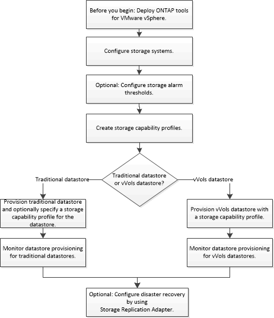

= Workflow for configuring ONTAP® tools for VMware vSphere
:icons: font
:imagesdir: ../media/

[.lead]
Configuring ONTAP tools involves configuring your storage systems, creating a storage capability profile, provisioning the datastore, and optionally configuring SRA for disaster recovery.

