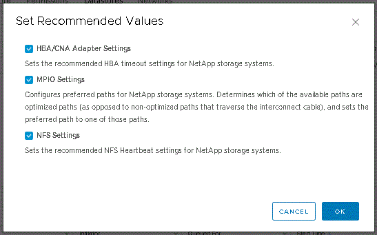

= Configure ESXi server multipathing and timeout settings
:icons: font
:imagesdir: ../media/

[.lead]
ONTAP tools for VMware vSphere checks and sets the ESXi host multipath settings and HBA timeout settings that work best with NetApp storage systems.

*About this task*

This process might take a long time, depending on your configuration and system load. The task progress is displayed in the Recent Tasks panel. As the tasks are completed, the host status Alert icon is replaced by the Normal icon or the Pending Reboot icon.

*Steps*

. From the VMware vSphere Web Client Home page, click *vCenter* > *Hosts*.
. Right-click a host, and then select *Actions* > *NetApp VSC* > *Set Recommended Values*.
. In the NetApp Recommended Settings dialog box, select the values that work best with your system.
+
The standard, recommended values are set by default.
+

. Click *OK*.
