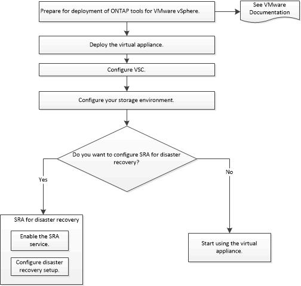

= Deployment workflow for new users of ONTAP tools for VMware vSphere
:icons: font
:imagesdir: ../media/

[.lead]
If you are new to VMware and have never used a NetApp VSC product, you need to configure your vCenter Server and setup an ESXi host, before you deploy and configure the ONTAP tools.

