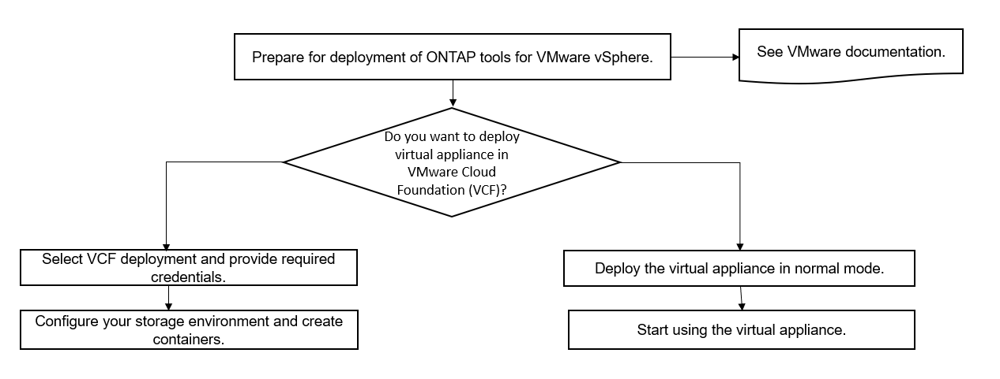

= VMware Cloud Foundation mode of deployment for ONTAP tools
:icons: font
:imagesdir: ../media/

[.lead]
ONTAP tools for VMware vSphere can be deployed in VMware Cloud Foundation (VCF) environment. The main objective of VCF deployment is to use ONTAP tools in a cloud setup and create containers without vCenter Server.

The VCF mode enables you to create containers for your storage without the need for a vCenter Server. VASA Provider is enabled by default after the deployment of ONTAP tools in VCF mode. After the deployment is complete, you can add storage systems and create containers using REST APIs. A new API is introduced to generate the _appliance-api-token_ that authenticates API calls. Some of the existing APIs are modified to include the _appliance-api-token_ header.

The APIs available for VCF deployment mode are:
|===
| *API* | *HTTP method* | *New/modified* | *Section header*
a|
/1.0/admin/containers
a|
GET
a|
New
a|
Container
a|
/1.0/admin/containers
a|
POST
a|
New
a|
Container
a|
/1.0/vcf/user/login
a|
POST
a|
New
a|
User Authentication
a|
/1.0/admin/storage-systems
a|
GET
a|
Modified
a|
Storage Systems
a|
/1.0/admin/storage-systems
a|
POST
a|
Modified
a|
Storage Systems
a|
/2.0/storage/clusters/discover
a|
POST
a|
Modified
a|
Storage Systems
a|
/2.0/storage/capability-profiles
a|
GET
a|
Modified
a|
Storage Capability Profile
a|
/2.0/tasks/{id}
a|
GET
a|
Modified
a|
Task
a|
|===

You can only work with vVols datastores in the VCF deployment mode. To create container, you need to use REST APIs customized for VCF deployment. The REST APIs can be accessed from the Swagger interface after the deployment is complete. While creating containers in VCF mode, you need to provide names of storage VM, aggregate and volume. You need to use ONTAP APIs to get these details as the ONTAP tools GET APIs for these resources are not updated.

|===
| *Storage object* | *API*
a|
Storage VM
a|
api/svm/svms
a|
Aggregate
a|
storage/aggregates
a|
Volume
a|
storage/volumes
a|
|===

While executing container create API, you can add existing volumes to the container. But you should ensure that the compression and deduplication values of the existing volumes matches the storage capability of the container. The virtual machine creation fails when the values do not match. The following table provides details on the values that existing volumes should have for corresponding storage capability profiles.

|===
| *Container Storage capability profile* | *Deduplication* | *Compression*
a|
Platinum
a|
Both
a|
Both
a|
AFF_Thick
a|
Both
a|
Both
a|
AFF_Default
a|
Both
a|
Both
a|
AFF_Tiering
a|
Both
a|
Both
a|
AFF_Encrypted
a|
Both
a|
Both
a|
AFF_Encrypted_Tiering
a|
Both
a|
Both
a|
AFF_Encrypted_Min50
a|
Both
a|
Both
a|
FAS_Default
a|
Background
a|
None
a|
FAS_Max20
a|
Background
a|
None
a|
Bronze
a|
None
a|
None
a|
|===

You can use the ONTAP PATCH API to set the appropriate values.

`https://<machine_IP>/api/storage/volumes/{uuid}`

The VCF deployment of ONTAP tools allows only container creation workflows. If you want to use other workflows such as provisioning datastores, creating storage capability profiles, or disaster recovery, then you should register ONTAP tools with vCenter Server using the Register.html page. The limitation of ONTAP tools in VCF mode is that you cannot configure SRA for disaster recovery.

link:../deploy/task_deploy_ontap_tools.html[How to deploy ONTAP tools]
