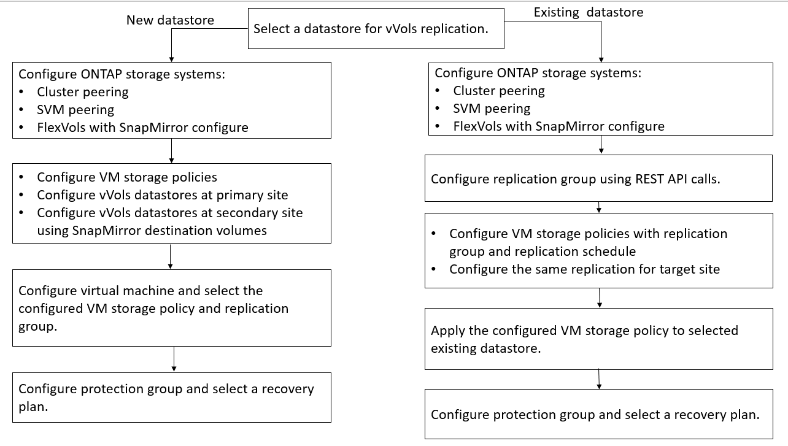

= Configure vVols replication for existing datastores
:icons: font
:imagesdir: ../media/

[.lead]
The vVols replication feature is enhanced to provide vVols replication for existing virtual machines that were created before SRM setup. This enables you to recover existing virtual machines and protect them on the recovery site.

*What you will need*

* Cluster and SVM are peered.
* Datastores and FlexVol volumes are created on source and target sites.
* Source and target sites have same storage capability profiles.
* FlexVol volumes are having same SnapMirror schedule.
* vVols replication is enabled.

An existing datastore does not have replication groups created.

*Steps*

. Access Swagger interface.
. Execute the REST API command <<TBD>> to configure replication group for existing datastore.
. Create VM Storage policy for existing vVols datastore with the storage capability profile that was used to create the datastore.
+
Add the replication policy, replication schedule, and compatible datastore from the available list.

 .. Access the unprotected virtual machine and edit the VM storage policy.
 .. Select the VM Storage policy and datastore.
 .. Add the replication group to the unprotected virtual machine.

You should perform the same steps on the destination site.
